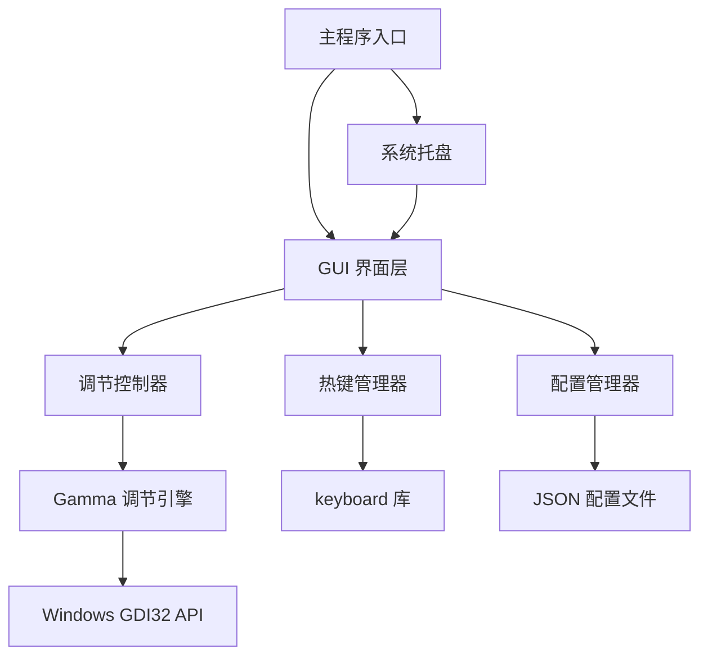

# GammaTool - 屏幕亮度调节工具架构设计

## 项目概述

GammaTool 是一个轻量级的 Windows 屏幕亮度调节工具，支持灰度、亮度、对比度以及 RGB 三色通道的自定义调节。

## 技术栈

### 核心技术
- **编程语言**: Python 3.8+
- **GUI 框架**: PyQt5 / PySide6（现代化界面，支持样式定制）
- **系统 API**: Windows GDI32.dll（用于 Gamma 值调节）
- **热键库**: keyboard（全局热键监听）
- **配置管理**: JSON（轻量级配置存储）
- **打包工具**: PyInstaller（生成独立可执行文件）

### 依赖库
```
PyQt5>=5.15.0
keyboard>=0.13.5
pywin32>=305
```

## 系统架构



## 核心模块设计

### 1. Gamma 调节引擎 (gamma_engine.py)

**功能**: 通过 Windows GDI32 API 调节屏幕 Gamma 值

**核心方法**:
- `set_brightness(value)`: 设置亮度（0-200，默认100）
- `set_contrast(value)`: 设置对比度（0-200，默认100）
- `set_grayscale(value)`: 设置灰度（0-100，默认0）
- `set_rgb_channels(r, g, b)`: 设置 RGB 通道（0-255）
- `reset_to_default()`: 恢复默认设置
- `apply_gamma_ramp(ramp)`: 应用 Gamma 斜坡数组

**技术实现**:
```python
import ctypes
from ctypes import windll, byref, Structure, c_ushort

class RAMP(Structure):
    _fields_ = [
        ('Red', c_ushort * 256),
        ('Green', c_ushort * 256),
        ('Blue', c_ushort * 256)
    ]

# 使用 GetDC 和 SetDeviceGammaRamp
```

### 2. GUI 界面层 (main_window.py)

**功能**: 提供用户交互界面

**界面组件**:
- 亮度滑块（Slider）+ 数值显示
- 对比度滑块 + 数值显示
- 灰度滑块 + 数值显示
- RGB 三色通道滑块（红、绿、蓝）
- 热键设置按钮
- 恢复默认按钮
- 最小化到托盘按钮

**界面风格**:
- 现代化扁平设计
- 深色/浅色主题切换
- 半透明窗口效果
- 圆角边框
- 平滑动画过渡

### 3. 热键管理器 (hotkey_manager.py)

**功能**: 管理全局热键绑定

**核心方法**:
- `register_hotkey(key_combo, callback)`: 注册热键
- `unregister_hotkey(key_combo)`: 注销热键
- `start_listening()`: 开始监听
- `stop_listening()`: 停止监听

**默认热键**:
- `Ctrl+Alt+Up`: 增加亮度
- `Ctrl+Alt+Down`: 降低亮度
- `Ctrl+Alt+R`: 恢复默认
- 支持用户自定义

### 4. 配置管理器 (config_manager.py)

**功能**: 保存和加载用户配置

**配置项**:
```json
{
  "brightness": 100,
  "contrast": 100,
  "grayscale": 0,
  "rgb": {
    "red": 255,
    "green": 255,
    "blue": 255
  },
  "hotkeys": {
    "increase_brightness": "ctrl+alt+up",
    "decrease_brightness": "ctrl+alt+down",
    "reset": "ctrl+alt+r"
  },
  "theme": "dark",
  "auto_start": false
}
```

**存储位置**: `%APPDATA%/GammaTool/config.json`

### 5. 系统托盘 (tray_icon.py)

**功能**: 提供系统托盘图标和菜单

**托盘菜单**:
- 显示/隐藏主窗口
- 快速调节（子菜单）
- 恢复默认
- 开机自启动
- 退出程序

## 项目结构

```
GammaTool/
├── src/
│   ├── __init__.py
│   ├── main.py                 # 程序入口
│   ├── gamma_engine.py         # Gamma 调节引擎
│   ├── main_window.py          # 主窗口界面
│   ├── hotkey_manager.py       # 热键管理器
│   ├── config_manager.py       # 配置管理器
│   ├── tray_icon.py            # 系统托盘
│   └── utils.py                # 工具函数
├── resources/
│   ├── icons/                  # 图标资源
│   │   ├── app_icon.ico
│   │   └── tray_icon.png
│   └── styles/                 # 样式文件
│       └── dark_theme.qss
├── config/
│   └── default_config.json     # 默认配置
├── tests/                      # 测试文件
├── requirements.txt            # 依赖列表
├── setup.py                    # 安装脚本
├── build.spec                  # PyInstaller 配置
├── README.md                   # 项目说明
└── LICENSE                     # 许可证
```

## 核心算法

### Gamma 值计算

Gamma 调节通过修改 RGB 查找表（LUT）实现：

```python
def calculate_gamma_ramp(brightness, contrast, grayscale, r, g, b):
    """
    brightness: 0-200 (100 为默认)
    contrast: 0-200 (100 为默认)
    grayscale: 0-100 (0 为无灰度)
    r, g, b: 0-255 (255 为最大)
    """
    ramp = RAMP()
    
    for i in range(256):
        # 基础值
        value = i / 255.0
        
        # 应用对比度
        value = (value - 0.5) * (contrast / 100.0) + 0.5
        
        # 应用亮度
        value = value * (brightness / 100.0)
        
        # 限制范围
        value = max(0.0, min(1.0, value))
        
        # 转换为 16 位整数
        base_value = int(value * 65535)
        
        # 应用灰度
        if grayscale > 0:
            gray = int(base_value * (1 - grayscale / 100.0))
            ramp.Red[i] = int(gray * (r / 255.0))
            ramp.Green[i] = int(gray * (g / 255.0))
            ramp.Blue[i] = int(gray * (b / 255.0))
        else:
            ramp.Red[i] = int(base_value * (r / 255.0))
            ramp.Green[i] = int(base_value * (g / 255.0))
            ramp.Blue[i] = int(base_value * (b / 255.0))
    
    return ramp
```

## 性能优化

1. **延迟应用**: 滑块拖动时使用防抖，避免频繁调用 API
2. **缓存机制**: 缓存计算好的 Gamma 斜坡数组
3. **异步处理**: 热键响应使用异步处理，避免阻塞
4. **资源管理**: 及时释放 DC 句柄，避免内存泄漏

## 安全性考虑

1. **权限检查**: 检查是否有足够权限修改 Gamma 值
2. **异常处理**: 完善的异常捕获和恢复机制
3. **配置验证**: 验证配置文件的合法性
4. **安全退出**: 程序退出时恢复默认 Gamma 值

## 用户体验

1. **实时预览**: 调节时实时显示效果
2. **平滑过渡**: 使用动画实现平滑的数值变化
3. **快捷操作**: 支持键盘快捷键和鼠标滚轮
4. **状态保存**: 自动保存用户设置
5. **开机自启**: 可选的开机自动启动

## 打包和分发

### PyInstaller 配置

```python
# build.spec
a = Analysis(
    ['src/main.py'],
    pathex=[],
    binaries=[],
    datas=[
        ('resources', 'resources'),
        ('config', 'config')
    ],
    hiddenimports=['PyQt5'],
    hookspath=[],
    hooksconfig={},
    runtime_hooks=[],
    excludes=[],
    win_no_prefer_redirects=False,
    win_private_assemblies=False,
    cipher=None,
    noarchive=False,
)

pyz = PYZ(a.pure, a.zipped_data, cipher=None)

exe = EXE(
    pyz,
    a.scripts,
    a.binaries,
    a.zipfiles,
    a.datas,
    [],
    name='GammaTool',
    debug=False,
    bootloader_ignore_signals=False,
    strip=False,
    upx=True,
    upx_exclude=[],
    runtime_tmpdir=None,
    console=False,
    disable_windowed_traceback=False,
    target_arch=None,
    codesign_identity=None,
    entitlements_file=None,
    icon='resources/icons/app_icon.ico'
)
```

### 预期体积

- 未压缩: ~25-30 MB
- UPX 压缩后: ~15-20 MB

## 测试计划

1. **单元测试**: 测试各个模块的核心功能
2. **集成测试**: 测试模块间的交互
3. **UI 测试**: 测试界面响应和显示
4. **兼容性测试**: 测试不同 Windows 版本（Win10/11）
5. **性能测试**: 测试资源占用和响应速度

## 后续扩展

1. **多显示器支持**: 支持独立调节多个显示器
2. **预设方案**: 保存和加载多个预设配置
3. **定时任务**: 根据时间自动调节（护眼模式）
4. **色温调节**: 添加色温调节功能
5. **自动更新**: 实现自动检查和更新功能